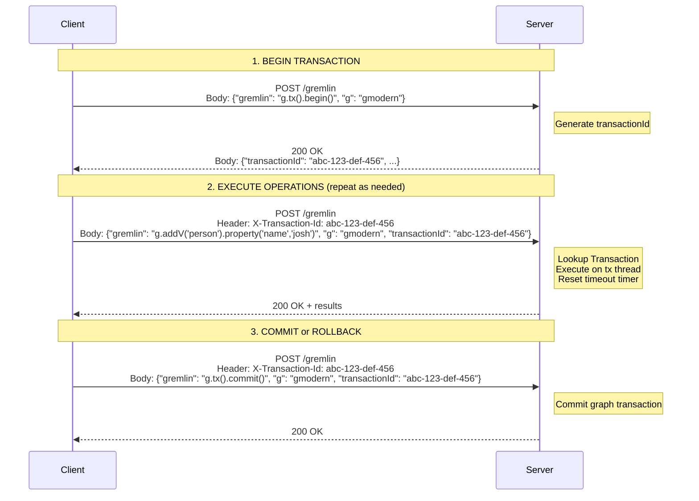

## Request Format Specification

**Endpoint:** `POST /gremlin`  
**Content-Type:** `application/json`

### Begin Request (no transactionId)

| Field | Type | Required | Description |
|-------|------|----------|-------------|
| `gremlin` | String | Yes | Must be `"g.tx().begin()"` |
| `g` | String | No | Graph/traversal source alias (e.g., `"g"`, `"gmodern"`, `"gcrew"`). Defaults to `"g"` if not specified |

### Begin Response

| Field | Type | Description |
|-------|------|-------------|
| `transactionId` | String | Server-generated String (UUID recommended) for this transaction  |
| `status` | Object | Standard status object with code and message |

### Subsequent Requests (with transactionId)

| Field | Type | Required | Description |
|-------|------|----------|-------------|
| `gremlin` | String | Yes | The Gremlin query to execute. For tx control: `"g.tx().commit()"`, `"g.tx().rollback()"` |
| `g` | String | No | Graph/traversal source alias (e.g., `"g"`, `"gmodern"`, `"gcrew"`). Defaults to `"g"` if not specified |
| `transactionId` | String | Yes | The server-generated transaction ID from the begin response. Omit for non-transactional requests |

### Required Header (for requests after begin)

| Header | Type | Description |
|--------|------|-------------|
| `X-Transaction-Id` | String | Same value as body `transactionId`. Used for load balancer routing |

---

## Protocol Flow

---