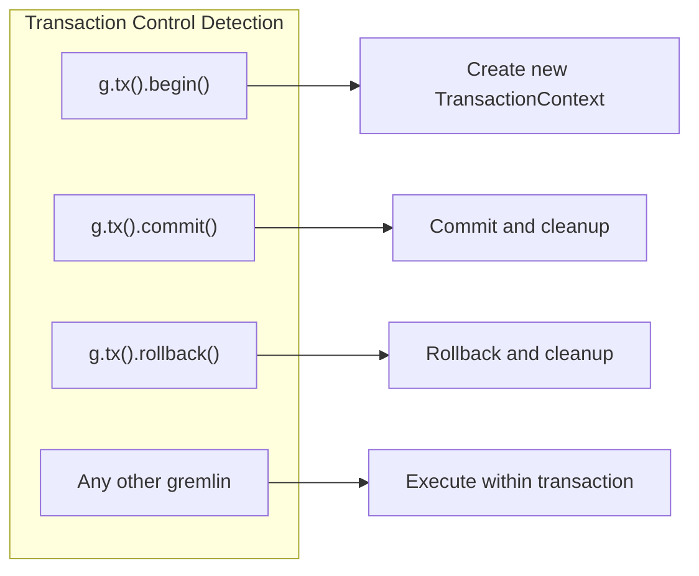
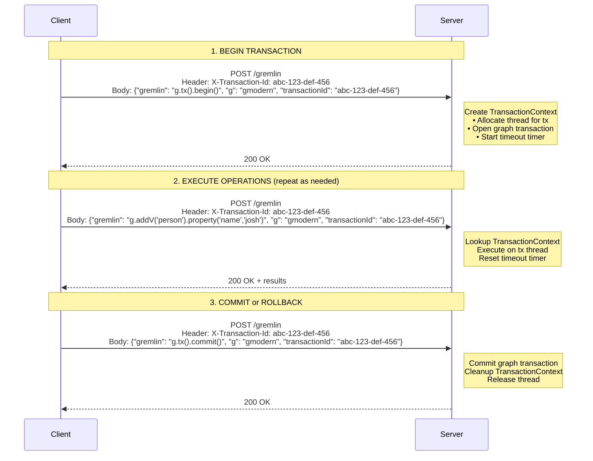
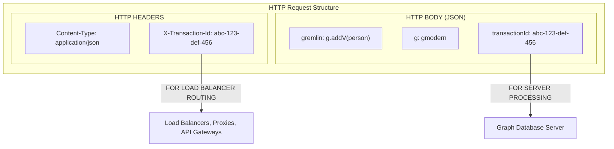
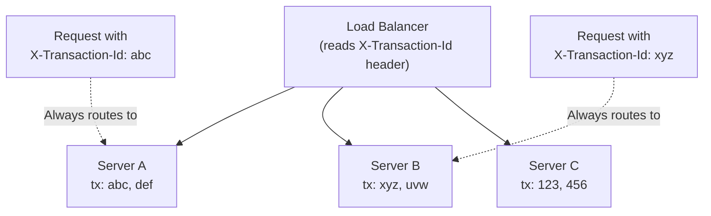

## Request Format Specification

**Endpoint:** `POST /gremlin`  
**Content-Type:** `application/json`

### Required Fields

| Field | Type | Description |
|-------|------|-------------|
| `gremlin` | String | The Gremlin query to execute. For tx control: `"g.tx().begin()"`, `"g.tx().commit()"`, `"g.tx().rollback()"` |
| `g` | String | Graph/traversal source alias (e.g., `"g"`, `"gmodern"`, `"gcrew"`) |
| `transactionId` | String | Client-generated UUID. Must be consistent across all requests in the same transaction |

### Required Header

| Header | Type | Description |
|--------|------|-------------|
| `X-Transaction-Id` | String | Same value as body `transactionId`. Used for load balancer routing |

---

## Transaction Control Commands

The server must detect these exact Gremlin strings to handle transaction lifecycle:

**IMPORTANT:** String matching should be exact (after trimming whitespace)

---

## Protocol Flow

---

## Transaction ID: Dual Transmission Design

### Why Transaction ID Appears Twice

### Architectural Rationale

| Aspect | X-Transaction-Id HEADER | transactionId BODY FIELD |
|--------|------------------------|--------------------------|
| **Purpose** | Infrastructure routing | Application logic |
| **Used by** | Load balancers, proxies, API gateways | Graph database server to lookup transaction state |
| **Why needed** | Load balancers typically only inspect headers, not body. Enables sticky sessions without application-layer parsing. Works with any LB that supports header-based routing. | Server needs to associate request with correct transaction. Part of the Gremlin request protocol specification. Consistent with other request fields (gremlin, g, bindings). |

### Load Balancer Sticky Routing

