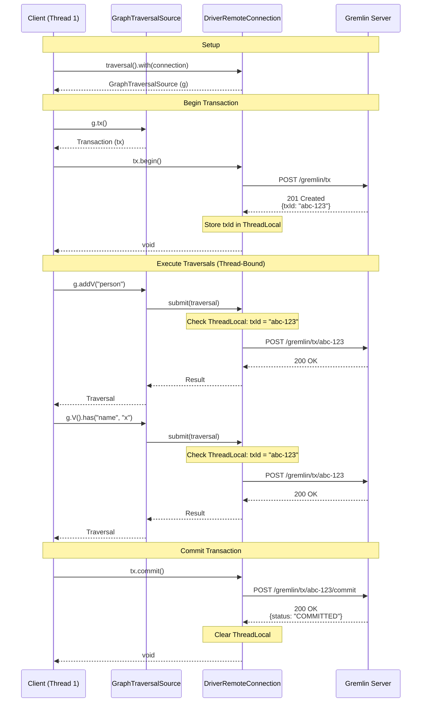
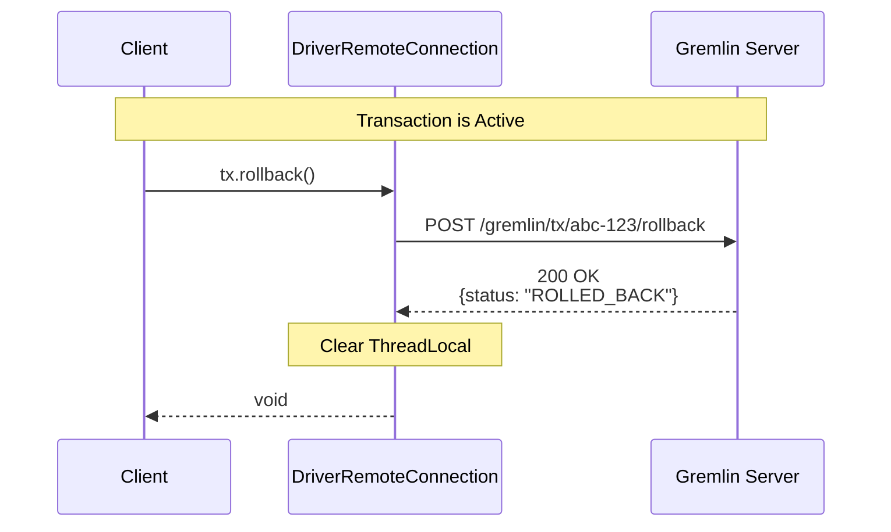
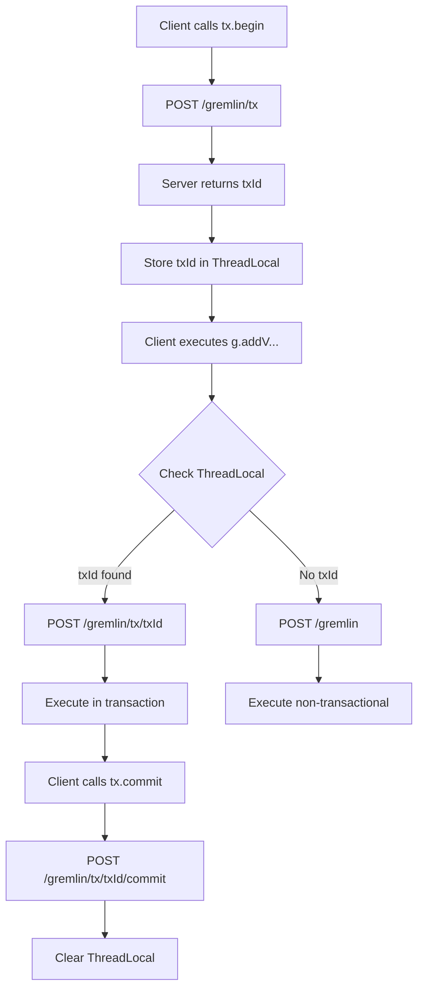

# Remote Transaction Flow

## Overview

This diagram shows the complete client-server interaction for remote transactions over HTTP. Transactions are thread-bound: when `tx.begin()` is called, all subsequent traversals on that thread automatically participate in the transaction.

Making these remote transactions thread-bound on the GLV-side makes it match the behavior for embedded transactions which are threaded by default. The API will likely force transactions to disallow multithreaded transactions which matches traditional relation database behavior. However, a subsequent update will likely allow multiple of these thread-bound transactions to exist, that is, a single thread will be able to have one or more transactions.

## Sequence Diagram

## Rollback Flow

## Thread-Bound Behavior

### Key Points

1. **ThreadLocal Storage**: When `tx.begin()` is called, the transaction ID is stored in a ThreadLocal variable
2. **Automatic Binding**: All traversals submitted on that thread automatically check ThreadLocal for an active transaction
3. **Endpoint Selection**: 
   - If transaction ID found in ThreadLocal → use `POST /gremlin/tx/{txId}`
   - If no transaction ID → use `POST /gremlin` (non-transactional)
4. **Thread Cleanup**: `tx.commit()` or `tx.rollback()` clears the ThreadLocal for that thread
5. **Thread Isolation**: Different threads can have different active transactions

### Behavior Diagram

