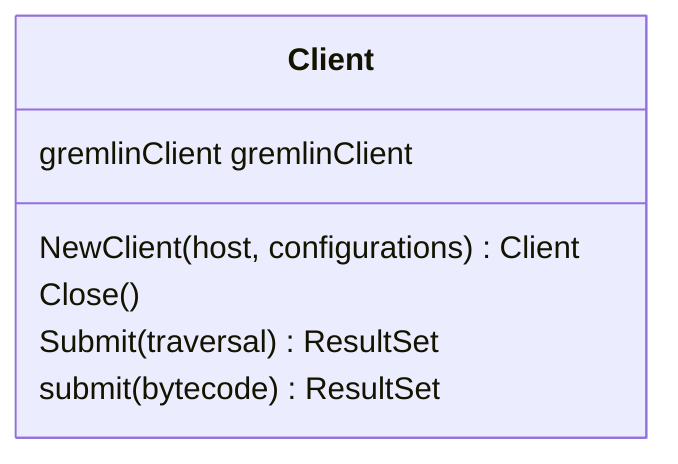
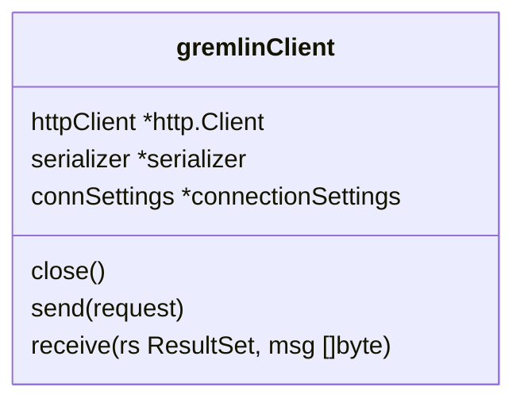
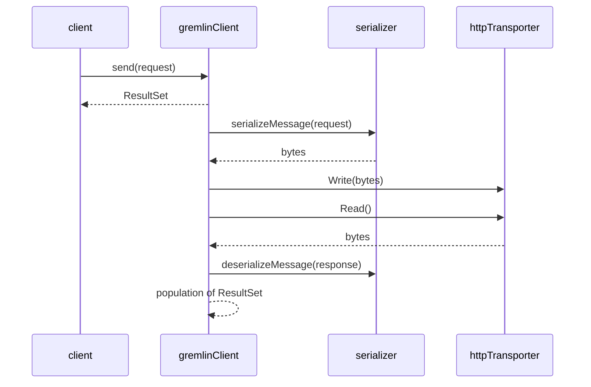

<!--

 Licensed to the Apache Software Foundation (ASF) under one
 or more contributor license agreements.  See the NOTICE file
 distributed with this work for additional information
 regarding copyright ownership.  The ASF licenses this file
 to you under the Apache License, Version 2.0 (the
 "License"); you may not use this file except in compliance
 with the License.  You may obtain a copy of the License at

 http://www.apache.org/licenses/LICENSE-2.0

 Unless required by applicable law or agreed to in writing,
 software distributed under the License is distributed on an
 "AS IS" BASIS, WITHOUT WARRANTIES OR CONDITIONS OF ANY
 KIND, either express or implied.  See the License for the
 specific language governing permissions and limitations
 under the License.

-->

# Gremlin-Go Design

## Entities

Gremlin-Go, named `gremlingo` as a package, consists of two main groups of entities at a high level: *Driver*-related and *Gremlin*-related entities. 

### Driver

Driver-related entities are used to handle the processing, parsing, and sending of Gremlin traversal queries. They are also responsible for deserializing responses from a Gremlin Server and the API for consuming the responses.

The entities are as follows, from the highest level to the lowest:

#### Client

A `Client` represents the entry point to interaction with a Gremlin-supported server. A URL parameter is required for construction, with additional configuration options such as HTTP headers and TLS configuration available.

##### Cardinalities

* One `gremlinClient`

##### Lifecycle and States

* The `Client` does not track or have any real state.
* However, `Close()` can be invoked on a `Client` in order to close any instances client resources.

#### gremlinClient

The `gremlinClient` entity handles invoking serialization and deserialization of data, as well as handling the lifecycle of raw data passed to and received from the `httpTransporter` layer. Upon sending a request, an instance of `gremlinClient` starts a `goroutine` to asynchronously read and populate data into a  `ResultSet`.

##### Cardinalities

* One `transporter`
* One `serializer`
* One `http.Client`

##### Lifecycle and States

* States
  * `closed bool`
* When `close()` is invoked, set the `closed` boolean to `true` which will terminate the `goroutine` used for asynchronously reading, and invoke `close()` on the `transporter`.

#### serializer

A `serializer` is responsible for translating the traversal into binary format for sending and vice versa for receiving data from a Gremlin server.  It is also responsible for identifying the data types of arguments and responses to properly delegate them to the appropriate internal type serializer.

##### Cardinalities

* N/A

##### Lifecycle and States

* N/A

#### httpTransporter

The `httpTransporter` is responsible for sending and receiving bytes to/from the server. It is intended for one `httpTransporter` to be instantiated per http request and response.

#### Result

A `Result` represents an individual output from a Gremlin traversal query. Its interface provides the ability to transform the output into Go data types for use.

##### Cardinalities

* N/A

Lifecycle and States

* N/A

#### ResultSet

A `ResultSet` is the immediate output of executing a Gremlin traversal. It contains a set of the individual `Result` types. `ResultSet` is populated asynchronously by a `goroutine` and thus also handles the providing of `Result` as they are available transparently to the user.

##### Cardinalities

* One or more `Result`

##### Lifecycle and States

* States
  * `closed bool`

* `ResultSet` has method `Close()` which can be used to stop the asynchronous generation of `Result` if it is no longer required. Sets `closed` to `true`.

### Gremlin

Gremlin-related entities are for the purpose of enabling the Gremlin query language to be used programmatically in Go. They responsible for integration with the Driver components, as well as translating the query language to a format that can be sent and consumed by a Gremlin-supported server. Most importantly, these entities are what allow the actual writing of Gremlin traversals in Go.

#### DriverRemoteConnection

A `DriverRemoteConnection` is an entity that represents a connection to a remote Gremlin Server, and is consumed as a parameter when creating a traversal. It wraps a `Client` in order to provide the proper context and interface for a traversal to communicate with the Driver-related entities. Like the `Client`, it can take in configuration, which is passed through to the `Client` it owns.

##### Cardinalities

* One `Client`

##### Lifecycle and States

* `DriverRemoteConnection` does not keep track of state, but it exports method `Close()` which invokes `Close()` on the `Client` it owns.

#### GraphTraversal

The `GraphTraversal` is the programmatic representation of a Gremlin traversal. It is the entity that methods are invoked and chained off of to build a traversal.

##### Cardinalities

* One `bytecode`

##### Lifecycle and States

* As a programmatic representation of a traversal, this is not applicable.

#### bytecode

`bytecode` is the byte representation of a traversal that a Gremlin Server consumes and understands. Each `GraphTraversal` owns one of these, and builds it up to represent the `GraphTraversal`.

##### Cardinalities

* N/A

##### Lifecycle and States

* N/A

## Errors

For a list of driver-side errors that may occur and common fixes, see:

TODO